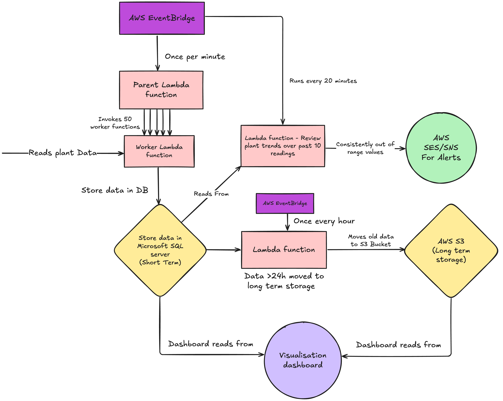

# LMNH Plant Tracker

Project for collecting and visualising data for plants in the possession of the Liverpool Museum of Natural History

Plant data is collected once per minute, every minute for every plant. This data is stored in  a short-term database for 24 hours,
after which it is moved to a longer term database.

Extra details can be found [here](https://curriculum.sigmalabs.co.uk/Data-Engineering/Week%205/overview)

---

# Development

- Features should be worked on in their own branch. Once passed by QA, can be merged into main.
- No broken, erroneous or 'bad' code should be in a PR.
- Code should follow industry best practices. For Python this means PEP8, and should be linted at every step.
- Code should be clear and documented where necessary.

Architecture Diagram:

