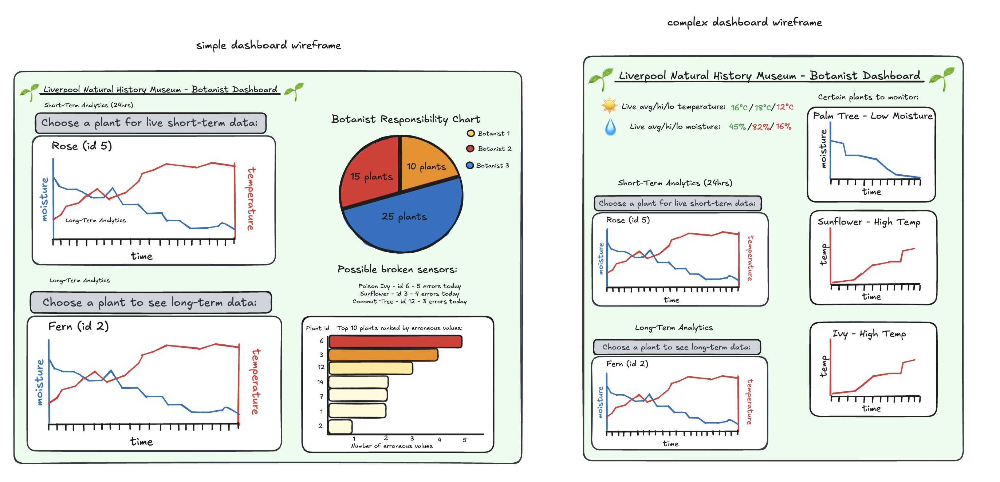

# Folder for dashboard / visualisations
This folder contains a Streamlit dashboard that loads data from the RDS using pyodbc (due to various issues using pymssql).
The next steps for the dashboard are to integrate long-term data using the S3, then host on the cloud.
To run locally: `streamlit run dashboard.py`.

# Requirements

To install requirements run:
`pip install -r requirements.txt`

A .env file must contain these variables:

```
DB_HOST=
DB_NAME=
DB_USERNAME=
DB_PASSWORD=
DB_PORT=

AWS_ACCESS_KEY_ID=
AWS_SECRET_ACCESS_KEY=

```


Dashboard Wireframe:

